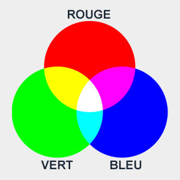

# Chapitre 3: Des boutons et du texte.

## 1. Les couleurs en informatique.

!!! note
    En informatique, nous utilisons les couleurs de bases dites RGB en anglais **(Rouge (Red), Vert (Green), Bleu (Blue))**.  
    Pour représenter une couleur, il faut combiner les différentes intensités de ces trois couleurs de base. 



!!! info
    La valeur numérique d'une composante de base (R, G et B) est une valeur numérique entre 0 et 255.  
    0 signifie aucune intensité de couleur, et 255 signifie une intensité maximale.  
    Pour obtenir une couleur spécifique il faut combiner les trois valeurs de rouge, vert et bleu.  
    Par exemple, le **blanc** pur est obtenu en ayant les trois composantes à 255 **(255, 255, 255)**, tandis que le **noir** pur est obtenu en ayant toutes les composantes à 0 **(0, 0, 0)**.


!!! success
    Dans Pybot, nous associons les trois valeurs RGB dans une variable selon l'exemple ci-dessous:  
    **variable = (R, G, B)**

    ```python
    couleur_violette = (128, 0, 128)
    couleur_noir = (0, 0, 0)
    couleur_blanc = (128, 0, 128)
    couleur_orange = (255, 127, 0)
    ```

!!! note
    Vous pouvez utiliser un selectionneur de couleur pour trouver une couleur spécifique. Par exemple [ce site](https://colorpicker.me/).

## 2. Afficher la couleur du fond d'écran et la changer.

Pour changer la couleur du fond d'écran on utilise la méthode **robot.couleur_fond(couleur)** ou couleur est au format **variable = (R, G, B)**.

!!! success
    ```python
    robot.couleur_fond(couleur)
    ```

Pour afficher cette couleur il faut utiliser une autre méthode **robot.afficher_fond()**.

!!! success
    ```python
    robot.afficher_fond() 
    ```
    
## 3. 

## 4.
