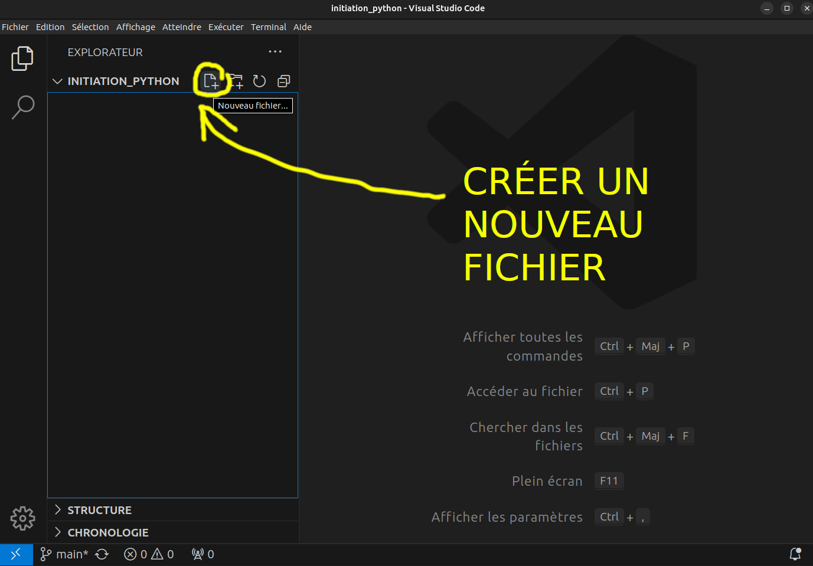

# Configurer l'éditeur VS Code pour programmer le robot.

## Configurer l'environnement python et installer les dépendances

!!! success "Commandes :"

    ```bash
    git clone git@github.com:42Angouleme/pybot.git
    cd pybot
    python -m venv venv
    source venv/bin/activate
    pip install -r requirements.txt
    ```

## Lancer le programme principal

!!! success "Commandes :"
    Utiliser la commande python avec le nom du fichier terminant avec .py où se trouve le programme.

    ```bash
    python3 main.py
    ```

## Pour préparer vscode

!!! success "Commandes :"

    ```bash
    code --install-extension ms-python.python
    code --install-extension MS-CEINTL.vscode-language-pack-fr
    cd pybot
    code main.py
    ```

# Cliquer sur l'icone extension


# Chercher python et installer


# Python est installé


# Ouvrir l'explorateur de fichiers


# Créer un nouveau fichier





# Nommer le fichier


# Écrire son code dans le fichier


# Lancer le programme


