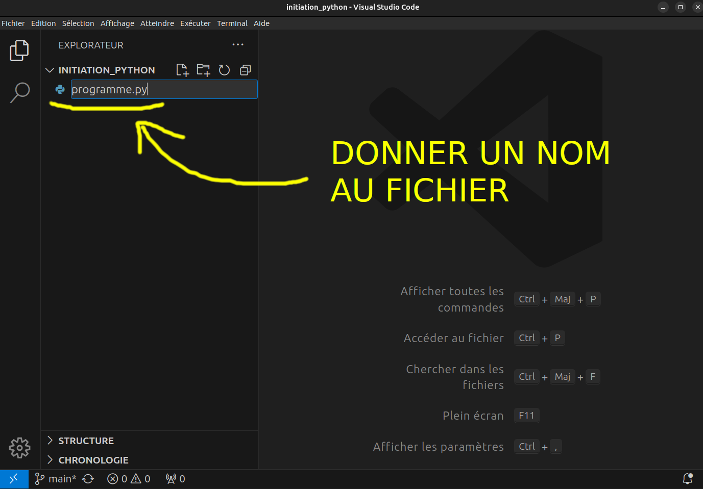

# Configurer l'éditeur VS Code pour programmer le robot

Pour installer les dépendances
```
git clone git@github.com:42Angouleme/initiation_python.git
cd initiation_python
python -m venv venv
source venv/bin/activate
pip install -r requirements.txt
```

Pour préparer vscode
```
code --install-extension ms-python.python
code --install-extension MS-CEINTL.vscode-language-pack-fr
cd initiation_python
code main.py
```

# Cliquer sur l'icone extension


# Chercher python et installer


# Python est installé


# Ouvrir l'explorateur de fichiers


# Créer un nouveau fichier


# Nommer le fichier





# Écrire son code dans le fichier


# Lancer le programme


# Configurer la librairie pybot sur Debian (La distribution linux sur le raspberry pi)

