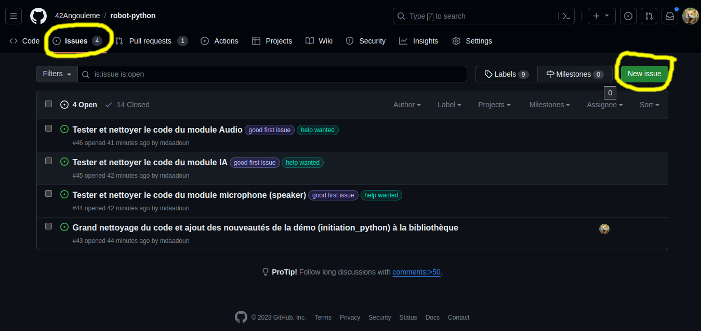
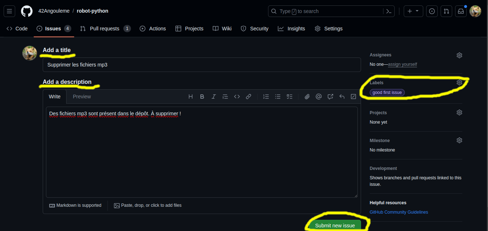
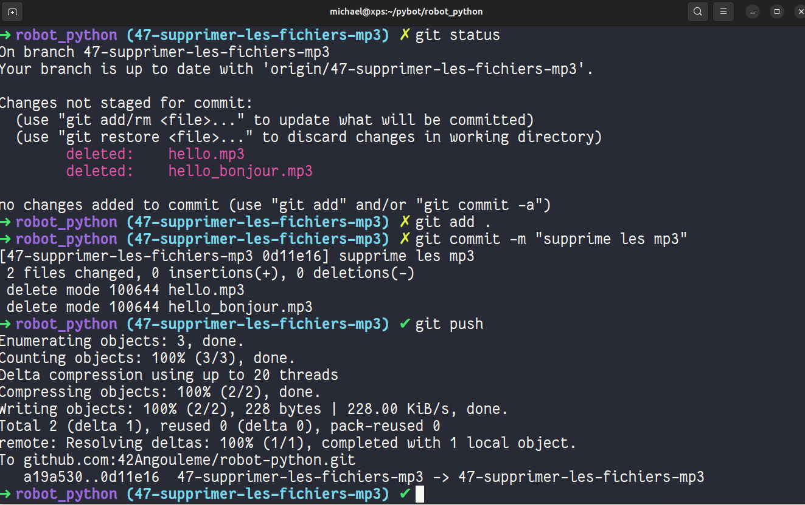
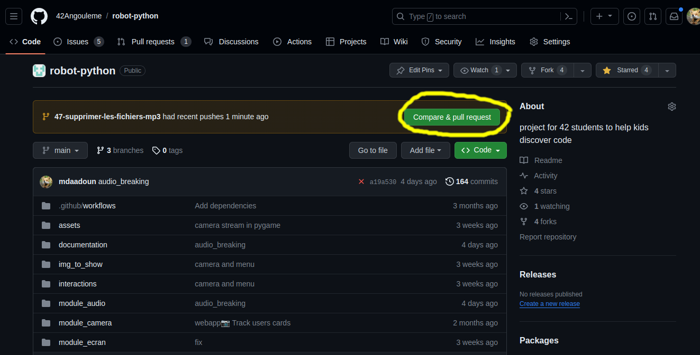
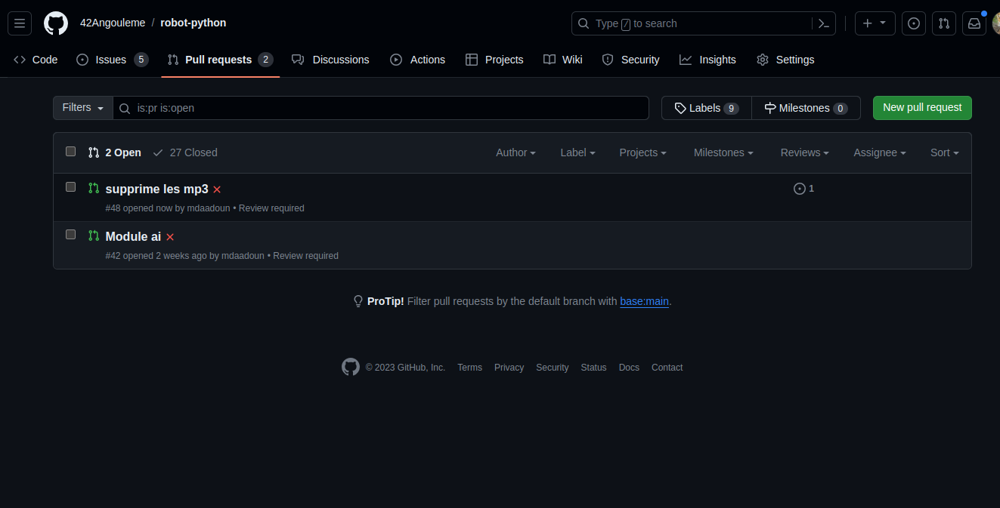

# Contribuer au projet Pybot

> L'objectif est de créer une bibliothèque logicielle qui permettra à des élèves de collège de niveau 3éme de réaliser un robot par eux même (Tout en s'initiant à la programmation Python).

Il existe deux dépôts public sur github, l'un avec la [bibliothèque pybot](https://github.com/42Angouleme/pybot) et l'autre avec [la démo](https://github.com/42Angouleme/demo_pybot) qui a servi aux collègiens lors de la journée d'immersion à l'école de 42 Angoulême le *27 Novembre 2023*.

La démo est archivée est sert seulement comme référence, le développement se déroule exclusivement sur le dépôt de la bibliothèque pybot et les [tickets sont tous rassemblés ici](https://github.com/42Angouleme/pybot/issues).

## Installation du projet

La bibliothèque utilise le language Python avec un grand nombre de dépendances (pygame, flask, opencv...), pour l'installer en local il suffit de cloner le dépôt, installer un environnement virtuel python avec les dépendances.

```bash
git clone git@github.com:42Angouleme/pybot.git
cd pybot
python3 -m venv venv
source venv/bin/activate
python3 -m pip install -r requirements.txt
```

## Exploration et création de tickets

Pour participer au développement vous pouvez explorer les différents tickets en cours ou bien en ajouter de nouveaux.



Pour ajouter un ticket, il suffit de donner une indication sur le bug à corriger ou la fonctionnalité à ajouter. Il est aussi intéressant de mettre des tags pour indiquer quel est le type du ticket. Par exemple, un ticket avec le tag **good first issue** est utile pour signifier aux nouveaux développeurs qui souhaitent contribuer que ce ticket est un point d'entrée interressant pour découvrir et commencer à participer au code.



Une fois que le ticket est créé, tout le monde peut participer à la discussion pour aider à la résolution du problème. Lorsque vous souhaitez adopter un ticket pour le résoudre il suffit de **s'assigner à soi-même** la résolution du ticket (que ce soit le votre ou un ticket disponible qui est assigné à personne) et de **créer la branche depuis le ticket** (ce qui permet de fermer automatiquement le ticket lorsque la branche sera merge à la branche main).


Aprés avoir créé la branche, il faut la récupérer sur son code localement.

```bash
git fetch origin
git checkout numero-nom-de-la-branche
```

Il suffit ensuite de faire les modifications.


## Résolution de tickets

Une fois que l'on a résolu le ticket, l'objectif est d'amener sa contribution à être ajouté à la base de code principale (merge). Avec git on ajoute ses modifications sur la branche que l'on pousse sur le dépôt.



En retournant sur la [page du dépôt](https://github.com/42Angouleme/pybot) on constate maintenant qu'il est possible de créer une pull request. La pull request ne bloque pas la branche, il est ensuite toujours possible de faire d'autres modifications sur la branche. Toutes les modifications poussées sur la branche d'une pull request seront automatiquement ajoutées au futur merge.



Comme les tickets, les pull requests sont des espaces de discussions ouvert à tous et améliorable jusqu'à ce que le mainteneur valide et merge votre branche à la branche main.


Il existe une [liste des pull request](https://github.com/42Angouleme/pybot/pulls) comme il existe une liste de ticket (issues).



Quand le mainteneur fera le merge il supprimera la branche (ce qui supprimera par la même occasion le ticket lié).


La branche est merge et la modification est ajoutée à la branche **main** principale.


**Bravo, vous savez maintenant contribuer à un projet open source.**
