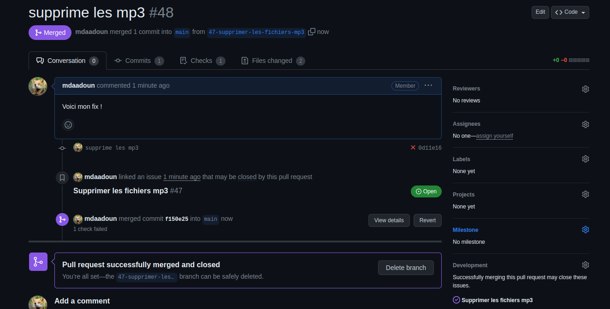
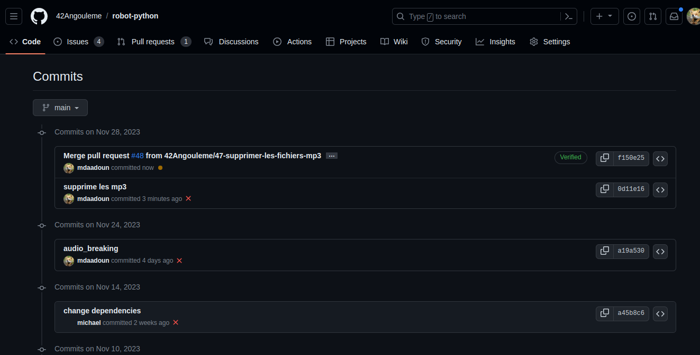

# Contribuer au projet Pybot

> L'objectif est de créer une bibliothèque logicielle qui permettra à des élèves de collège de niveau 3éme de réaliser un robot par eux même (Tout en s'initiant à la programmation Python).

Il existe deux dépôts public sur github, l'un avec la [bibliothèque python](https://github.com/42Angouleme/robot-python) et l'autre avec [la démo](https://github.com/42Angouleme/initiation_python) qui a servi aux collègiens lors de la journée d'immersion.

## Installation du projet

La bibliothèque utilise le language Python avec un grand nombre de dépendances (pygame, flask, opencv...), pour l'installer en local il suffit de cloner le dépôt et d'executer ces commandes dans le dossier.

```bash
python3 -m venv venv
source venv/bin/activate
python3 -m pip install -r requirements.txt
```

## Exploration et création de tickets

Pour participer au développement vous pouvez explorer les différents ticket en cours ou bien en ajouter.


Pour ajouter un ticket, il suffit de donner une indication sur le bug à corriger ou la feature à ajouter. Il est aussi intéressant de mettre des tags pour indiquer quel est le genre du ticket. Un ticket avec le tag **good first issue** est utile pour signifier aux nouveaux développeurs qui souhaitent contribuer que ce ticket est un point d'entrée interressant pour découvrir et commencer à participer au code.


Une fois que le ticket est créé, tout le monde peut participer à la discussion pour aider à la résolution du problème. Il est ensuite possible de s'assigner à soi-même la résolution du ticket (que ce soit le votre ou un ticket disponible qui n'est pas assigné).


TODO


## Résolution de tickets



