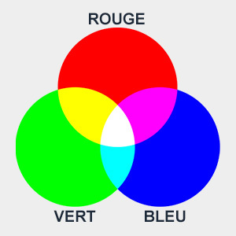
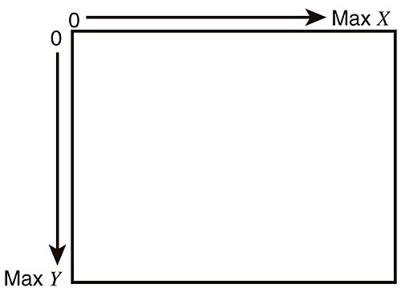

# Information General sur Python

## Les types de variables en Python

### Les int (integers | entiers)

Les int sont des entiers (nombre). Ils peuvent être positifs ou négatifs.

```python
    a = 5
    b = -3
    c = 10 + 17
```

### Les float (floating point | flottants)

Les float sont des nombres à virgule (nombre décimal). Ils peuvent être positifs ou négatifs.

```python
    a = 5.0
    b = -3.5
    c = 10.5 + 17.0
```

### Les str (strings | chaînes de caractères)

Les str sont des chaînes de caractères (texte). Ils sont délimités par des guillemets simples ou doubles.

```python
    a = "Bonjour"
    b = 'Bonjour'
    c = "Bonjour" + ' ' + 'tout le monde'
```

### Les bool (booleans | booléens)

Les bool sont des booléens (vrai ou faux). Ils sont utilisés pour les conditions.

```python
    a = True
    b = False
    c = 5 > 3 (vaut True)
```

## Les types specifique au robot

### Les couleurs

!! note
    En informatique, nous utilisons les couleurs de base dites RGB en anglais **(Rouge (Red), Vert (Green), Bleu (Blue))**.
    Pour représenter une couleur, il faut combiner les différentes intensités de ces trois couleurs de base.



!!! info
    La valeur numérique d'une composante de base (R, G et B) est une valeur numérique entre 0 et 255.
    0 signifie aucune intensité de couleur, et 255 signifie une intensité maximale.
    Pour obtenir une couleur spécifique il faut combiner les trois valeurs de rouge, vert et bleu.
    Par exemple, le **blanc** pur est obtenu en ayant les trois composantes à 255 **(255, 255, 255)**, tandis que le **noir** pur est obtenu en ayant toutes les composantes à 0 **(0, 0, 0)**.

!!! success
    Dans Pybot, nous associons les trois valeurs RGB dans une variable selon l'exemple ci-dessous:
    **variable = (R, G, B)**

```python
    couleur_violette = (128, 0, 128)
    couleur_noir = (0, 0, 0)
    couleur_blanc = (128, 0, 128)
    couleur_orange = (255, 127, 0)
```

!!! note
    Vous pouvez utiliser un sélecteur de couleur pour trouver une couleur spécifique. Par exemple via [ce site](https://colorpicker.me/).

On peut aussi utiliser la Class Couleur pour avoir des couleurs prédéfinies.

```python
    from pybot import Couleur

    couleur_violette = Couleur.VIOLET
    couleur_noir = Couleur.NOIR
    couleur_blanc = Couleur.BLANC
    couleur_orange = Couleur.ORANGE
```

!!! info
    Voila une liste de couleur prédéfinie dans la class Couleur:  
    ROUGE, VERT, BLEU, JAUNE, CYAN, MAGENTA, BLANC, GRIS, NOIR, ORANGE, ROSE, VIOLET, BLEU_CIEL, VERT_SAPIN

### User

C'est une structure de données qui contient les informations de l'utilisateur.

```python
    user = {
        "nom": "Jean",
        "prenom": "Dupont",
    }

    print(user["nom"]) # Affiche "Jean"
    print(user["prenom"]) # Affiche "Dupont"
```

### Les positions

Les positions x et y de la fenêtre  
    Les coordonnées dans une fenêtre informatique sont généralement définies à partir du coin supérieur gauche.  
    Le **premier pixel** qui se trouve en haut à gauche correspond aux coordonnées **x = 0 et y = 0**.  
    Alors que le dernier pixel en bas à droite correspond à la coordonnée x maximale et à la coordonnée y maximale.  
 Par exemple, si la fenêtre fait 300 pixels de long et 200 pixels de haut. Le **dernier pixel** a les coordonnées **x = 299 et y = 199**.  



## Les boucles

### La boucle while

La boucle while est une boucle qui répète un bloc d'instructions tant qu'une condition est vraie.  
Il faut indenté le bloc d'instructions (Tabulation) pour l'avoir dans la boucle.

```python
    i = 1
    while i < 6 :
        print(i)
        i += 1
    print("Fin de la boucle") # Ne sera pas dans la boucle
```

### break

Avec la boucle while, on peut utiliser le mot-clé break pour arrêter la boucle même si la condition est vraie.

!!!info
    Dans l'exemple ci-dessous, la boucle s'arrête lorsque i est égal à 3.  
    Les lignes en dessous du break et contenu dans la boucle ne seront pas exécutées.

```python
    i = 1
    while i < 6 :
        print(i)
        if i == 3 :
            break
        i += 1
```

## Les conditions

### La condition if

La condition if est utilisée pour exécuter un bloc de code si une condition est vraie.

```python
    a = 33
    b = 200
    if b > a :
        print("b est plus grand que a")
```

### La condition else

La condition else est utilisée pour exécuter un bloc de code si la condition if est fausse.

```python
    a = 33
    b = 200
    if b > a :
        print("b est plus grand que a")
    else :
        print("b est plus petit que a")
```

### La condition elif

La condition elif est utilisée pour exécuter un bloc de code si la condition if est fausse, mais une autre condition est vraie.

```python
    a = 33
    b = 33
    if b > a :
        print("b est plus grand que a")
    elif a == b :
        print("a et b sont égaux")
```

## Les fonctions

Une fonction est une séquence d'instructions qui effectue une tâche.
Elles définissent des actions à faire lors de leur appel.
Une fonction est constituée de son nom, des paramètres pris en entrée et de son type de retour.

```python
# Cette fonction affiche "bonjour"
def afficher_bonjour():
    print("Bonjour")

# Cette fonction affiche le contenu de mot
def afficher_argument(mot="Salut"):
    print(mot)

# Cette fonction affiche "Coucou" et renvoi le même mot
def afficher_et_renvoyer_coucou() -> str:
    mot = "Coucou"
    print(mot)
    return mot

def main():
    afficher_bonjour()
    afficher_argument("Bonjour à tous, je suis un argument")
    afficher_argument()
    retour = afficher_et_renvoyer_coucou()
    print("retour =", retour)
```
