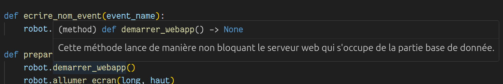

# Référence de la bibliothèque

Pour en savoir plus, dans un éditeur tel que vscode, il suffit de passer la souris sur une fonction pour voir les commentaires la concernant.



## l'écran

* Importer et utiliser pybot
```python
from pybot import Robot
robot = Robot()
```

* Démarrer webapp.
```python
robot.demarrer_webapp()
```

* Allumer l'écran.
```python
robot.allumer_ecran(longeur, hauteur)
```

* Changer le titre.
```python
robot.changer_titre(titre)
```

* Mettre à jour l'affichage dans la fenêtre.
```python
robot.dessiner_ecran()
```

* Entrer ou sortir du plein écran.
```python
plein_ecran(changer)
```

* Mettre en pause le robot.
```python
robot.dort(secondes)
```

* Vérifier si le robot est actif (Vrai ou Faux).
```python
robot.est_actif()
```

* Passer le robot en mode inactif.
```python
robot.desactiver()
```

* Passer le robot en mode inactif et fermer l'affichage.
```python
robot.eteindre_ecran()
```

## les évènements

Liste des touches pour créer des évènements:
```
* echap (touche Échap)
* espace (touche Espace)
* 0
* 1
* 2
* 3
* 4
* 5
* 6
* 7
* 8
* 9
* a
* b
* c
* d
* e
* f
* g
* h
* i
* j
* k
* l
* m
* n
* o
* p
* q
* r
* s
* t
* u
* v
* w
* x
* y
* z
* F1
* F2
* F3
* F4
* F5
* F6
* F7
* F8
* F9
* F10
* F11
* F12
* F13
* F14
* F15
```

* Créer un nouvel évènement.
```python
robot.ajouter_evenement(touche, nom)
```

* Vérifier les évènements.
```python
robot.verifier_evenements()
```

* Supprimer un évènement.
```python
robot.supprimer_evenement(nom)
```

### fond d'écran

* Changer la couleur du fond

```python
robot.couleur_fond(couleur)
```

* Afficher la couleur du fond d'écran

```python
robot.afficher_fond()
```

### les boutons

* 

### la caméra et la carte

*

### parler avec le robot

*

